<p align="center"></p>

# 學生使用手冊

> 國立臺灣科技大學　國際經濟趨勢與策略分析（彭文彥）
> 競賽網址：<https://emrd-invest.netlify.app/>

---

## 目錄

1. [註冊與登入](#1-註冊與登入)
2. [我的投資 — 看懂自己的資產](#2-我的投資--看懂自己的資產)
3. [交易下單 — 買台股](#3-交易下單--買台股)
4. [交易下單 — 買美股](#4-交易下單--買美股)
5. [賣出持股](#5-賣出持股)
6. [交易紀錄](#6-交易紀錄)
7. [排行榜](#7-排行榜)
8. [帳號設定](#8-帳號設定)
9. [常見問題](#9-常見問題)

---

## 1. 註冊與登入

打開 <https://emrd-invest.netlify.app/>，會看到登入畫面。

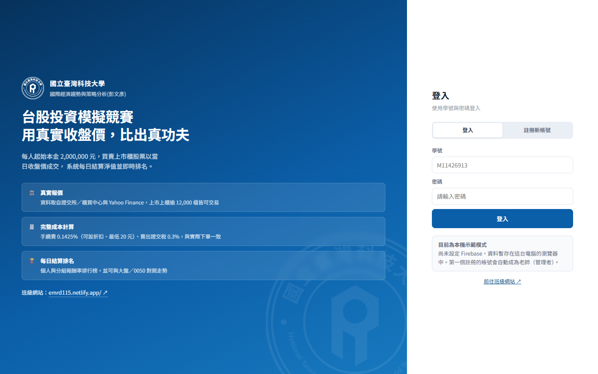

### 第一次使用：註冊新帳號

點上方的「**註冊新帳號**」分頁。

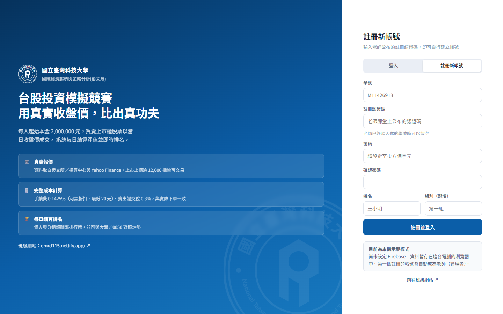

| 欄位 | 說明 |
|---|---|
| **學號** | 你的學號，例如 `M11426913`。大小寫都可以，系統會自動轉成大寫 |
| **註冊認證碼** | **老師在課堂上公布的代碼**。沒有這組碼無法註冊 |
| **密碼** | 自己設定，至少 6 個字元。**請記牢，忘記要找老師處理** |
| **確認密碼** | 再輸入一次 |
| **姓名** | 請填真實姓名，老師才知道你是誰 |
| **組別** | 選填，例如「第一組」。分組排名會用到 |

填完按「**註冊並登入**」就完成了，之後用**學號 + 密碼**登入即可。

> 💡 **不用電子信箱**。這個系統用學號當帳號，不會寄信給你。

### 如果老師已經匯入你的學號

老師若事先把全班名單匯入系統，你註冊時**認證碼可以留空**，直接設定密碼即可。

### 出現「再一步就完成了」

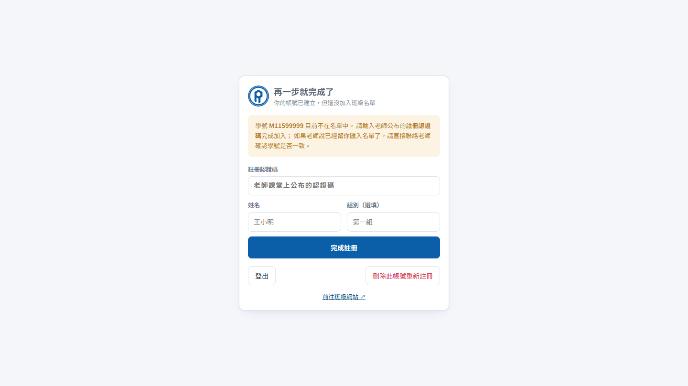

代表你的帳號建立了，但還沒加入班級名單 —— 通常是**認證碼打錯**。
在這個畫面直接補填正確的認證碼與姓名，按「完成註冊」即可，**不需要重設密碼**。

---

## 2. 我的投資 — 看懂自己的資產

登入後的第一個畫面。

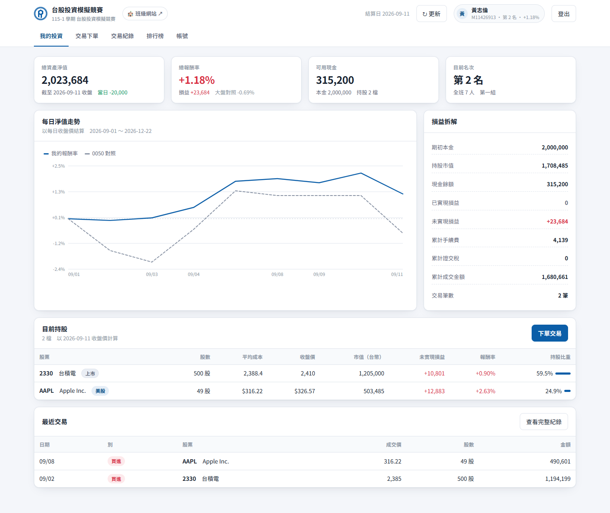

### 上方四個數字

| 名稱 | 意思 |
|---|---|
| **總資產淨值** | 現金 + 所有持股的市值。這就是排名的依據 |
| **總報酬率** | （總資產 − 200 萬）÷ 200 萬。旁邊會顯示同期大盤（0050）漲跌供對照 |
| **可用現金** | 還能用來買股票的錢 |
| **目前名次** | 你在全班的排名 |

### 每日淨值走勢

藍色實線是**你的報酬率**，灰色虛線是 **0050（台灣 50）的同期報酬率**。
把滑鼠移到線上可以看到每一天的確切數字。

**線在虛線上方 = 你打敗大盤。** 這是投資最基本的評分標準。

### 損益拆解

| 項目 | 意思 |
|---|---|
| **已實現損益** | 已經賣掉的部分，實際賺或賠了多少 |
| **未實現損益** | 還抱在手上的部分，帳面上賺或賠多少（賣掉才算數） |
| **累計手續費／證交稅** | 交易成本總共花了多少。**交易越頻繁，這個數字越大** |
| **累計成交金額** | 所有買賣金額加總，可以看出自己有多愛交易 |

### 目前持股

| 欄位 | 說明 |
|---|---|
| **平均成本** | 你買進的平均價格（**已包含手續費**） |
| **收盤價** | 最新的收盤價。美股顯示美元（`$326.57`），台股顯示台幣 |
| **市值（台幣）** | 這檔股票現在值多少台幣。**美股已自動換算** |
| **持股比重** | 這檔股票佔你總資產的百分比。可以用來檢視有沒有押太重 |

---

## 3. 交易下單 — 買台股

點上方分頁「**交易下單**」。

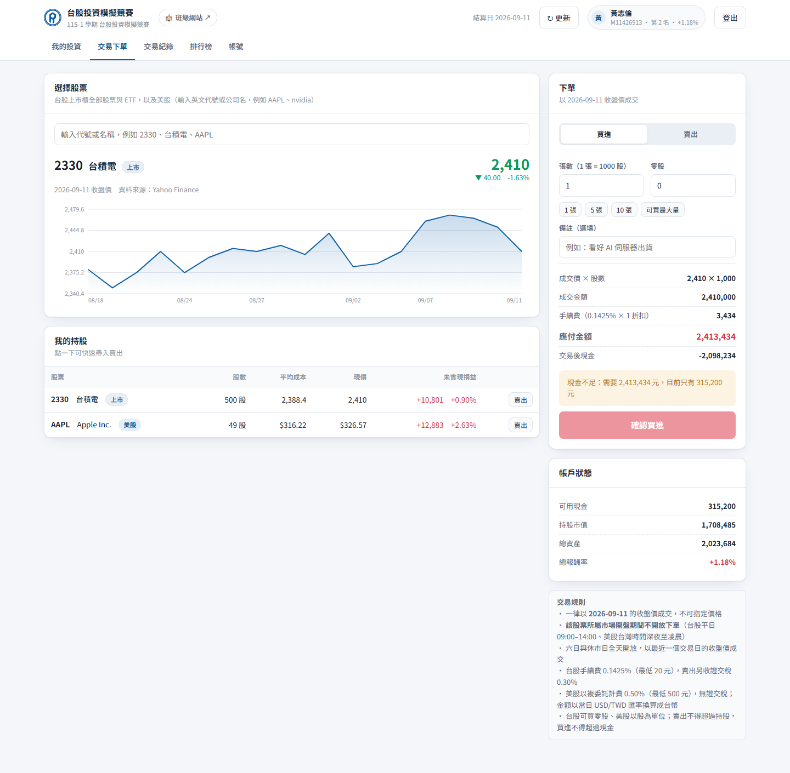

### 步驟一：搜尋並**點選**股票

在搜尋框輸入**代號**（`2330`）或**中文名稱**（`台積電`），下拉選單會出現符合的股票。

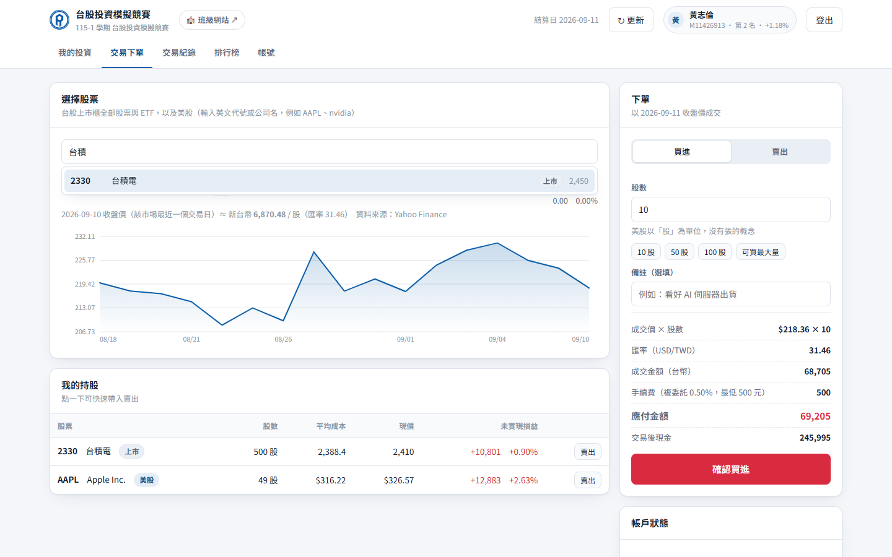

> ⚠️ **一定要點下拉選單中的那一列**（或按 Enter 選取）。
> 只打字不點選，系統不知道你要買哪一檔，「確認買進」會一直是灰色的。

選好之後，畫面會顯示這檔股票的**收盤價**、**漲跌**，以及最近 60 天的走勢圖。

### 步驟二：填股數

台股的單位是「**張**」，**1 張 = 1000 股**。

- **張數**：要買幾張
- **零股**：不滿一張的部分（0～999 股）

例如「2 張 500 股」= 2,500 股。

下方有快捷按鈕：`1張` `5張` `10張`，以及「**可買最大量**」（用現有現金能買的最多數量，已預留手續費）。

### 步驟三：確認費用並送出

右側會即時算出：

```
成交價 × 股數  →  成交金額  →  + 手續費  →  應付金額
```

確認「**交易後現金**」不會變成負數，按「**確認買進**」即可。

### 為什麼「確認買進」是灰色的？

系統一定會在按鈕上方**用文字告訴你原因**，常見的有：

| 顯示訊息 | 怎麼處理 |
|---|---|
| 請先在上方「選擇股票」搜尋並點選一檔股票 | 點下拉選單那一列 |
| 報價載入中，請稍候… | 等 2～3 秒 |
| 現在是盤中（10:30），暫停下單 | 等到當天 14:00 之後（見下方） |
| 現金不足：需要 X 元，目前只有 Y 元 | 減少張數，或按「可買最大量」 |
| 賣出股數超過持股 | 檢查自己實際持有幾股 |
| 競賽將於 2026-09-17 開始 | 還沒開賽 |

### ⏰ 盤中不能下單

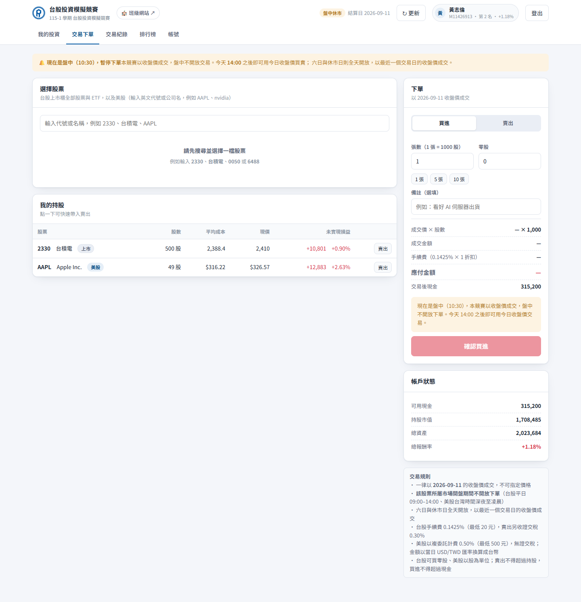

**平日 09:00～14:00（台股盤中）系統不開放下單。**

因為競賽是以**收盤價**成交的，如果盤中能下單，你就可以一邊看著股價上漲、一邊用昨天的舊收盤價買進 —— 那是穩賺不賠，比賽就不公平了。

| 時間 | 能不能交易 | 用哪一天的收盤價 |
|---|---|---|
| 平日 **09:00–14:00** | ❌ 不行 | — |
| 平日 14:00 ～ 隔天 09:00 | ✅ 可以 | **當天**收盤價 |
| **週六、週日** | ✅ 可以（全天） | **上週五**收盤價 |

畫面右上角出現「**盤中休市**」標籤時就是暫停下單中。**14:00 一到畫面會自動解鎖**，不用重新整理。

---

## 4. 交易下單 — 買美股

一樣在「交易下單」頁，搜尋框輸入**英文代號**（`AAPL`、`NVDA`、`TSLA`）或**公司名稱**（`nvidia`、`tesla`）。

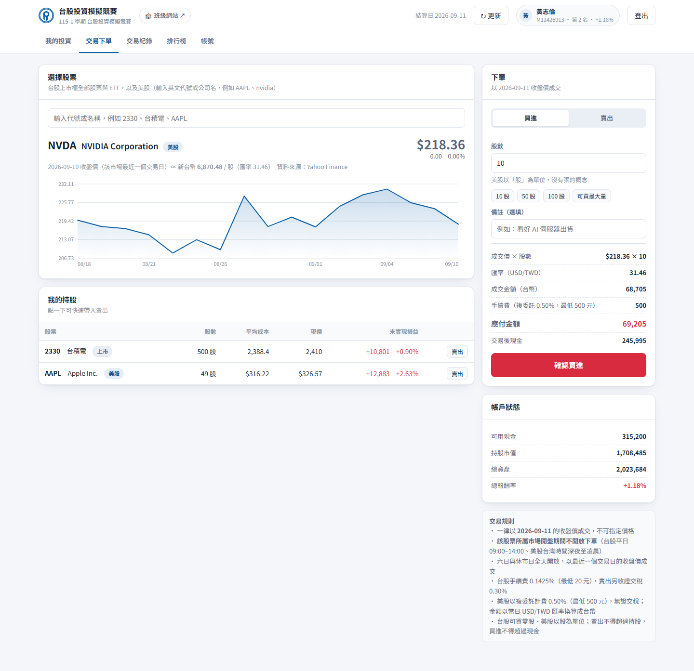

美股跟台股的差別：

| | 台股 | 美股 |
|---|---|---|
| **單位** | 張（1 張 = 1000 股）、零股 | **股**（沒有「張」的概念） |
| **股價顯示** | `2,410` | `$326.57`（美元） |
| **手續費** | 0.1425%，最低 20 元 | **0.5%**（複委託），最低 500 元 |
| **證交稅** | 賣出 0.3% | **無** |
| **幣別換算** | 不用 | **自動以當日匯率換成台幣** |

### 💱 匯率是怎麼算的

你的帳戶是台幣 200 萬，但美股用美元報價，所以系統會用**成交當日的 USD/TWD 匯率**換算。

下單畫面會清楚列出：

```
成交價 × 股數    $326.57 × 10
匯率（USD/TWD）  31.46
成交金額（台幣）  102,752
手續費（複委託 0.50%，最低 500 元）  513
應付金額         103,265
```

> 📌 **重要：你的報酬率會同時反映「股價」和「匯率」。**
>
> 假設你買了 AAPL，股價漲了 3%，但這段期間台幣升值 2%（匯率從 31.5 跌到 30.9），
> 換回台幣後你只賺了大約 1%。反過來說，台幣貶值時你會多賺。
>
> 這就是實際投資美股會遇到的**匯率風險**，也是這門課值得討論的題目。

### 美股的交易時間

美股的盤中是**台灣時間深夜到凌晨**，跟台股不同。系統會**分別判斷每一檔股票所屬的市場**，美股開盤時只會鎖住美股，台股不受影響。

---

## 5. 賣出持股

有兩個方法：

**方法一**：在「交易下單」頁，下方「**我的持股**」表格右邊有「賣出」按鈕，點下去會自動帶入該股票與全部股數。

**方法二**：先搜尋選取股票，再把上方的「買進／賣出」切換到「**賣出**」。

賣出時會多扣一筆**證交稅**（台股 0.3%，美股沒有），按鈕下方也有「**全部賣出**」快捷鍵。

> 賣出不能超過你實際持有的股數 —— 這個競賽**不能放空**。

---

## 6. 交易紀錄

點分頁「**交易紀錄**」，可以查詢所有買賣明細。

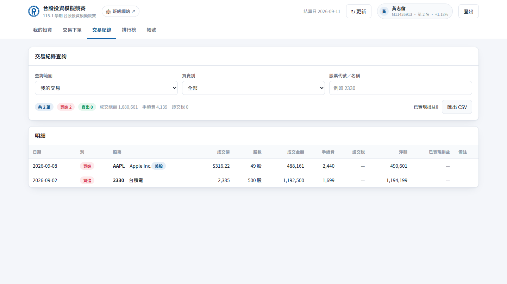

### 每一欄的意思

| 欄位 | 說明 |
|---|---|
| **成交價** | 當時的成交價格（美股顯示美元） |
| **成交金額** | 股數 × 成交價（美股已換算台幣） |
| **手續費／證交稅** | 這筆交易的成本 |
| **淨額** | 買進＝實際扣款；賣出＝實際入帳 |
| **已實現損益** | **只有賣出才有**。= 賣出實收 − 賣出股數 × 平均成本 |

### 看全班的交易

把「**查詢範圍**」切到「**全班交易**」，可以看到所有同學的買賣紀錄，也能指定看某一位同學。

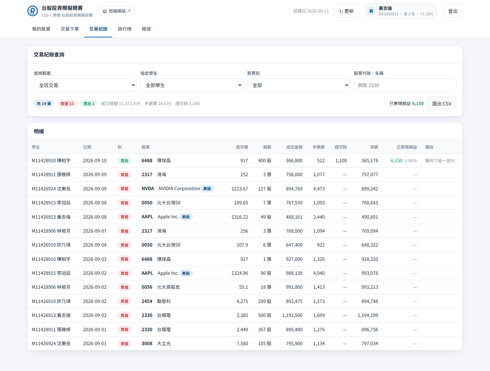

> 這是刻意公開的 —— 投資競賽本來就該互相觀摩。看看排名前面的同學買了什麼、什麼時候進場，是很好的學習方式。

右上角「**匯出 CSV**」可以下載成 Excel 檔自己做分析。

---

## 7. 排行榜

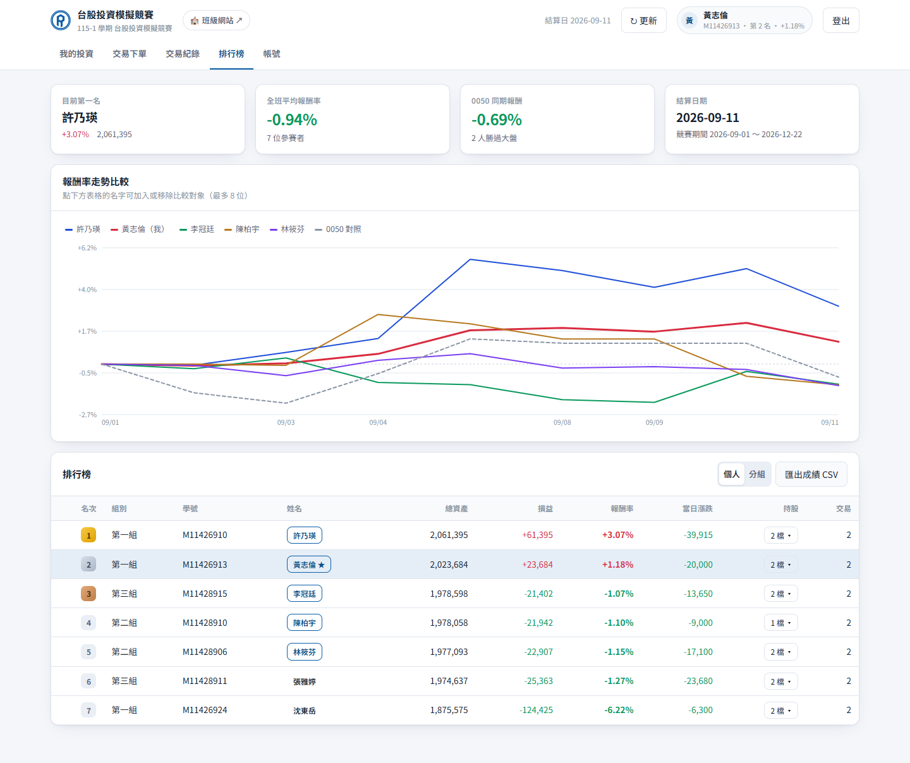

### 上方四個指標

- **目前第一名**：誰領先，報酬率多少
- **全班平均報酬率**：整體表現
- **0050 同期報酬**：大盤的表現，以及**幾個人贏過大盤**
- **結算日期**：目前排名是以哪一天的收盤價計算

### 報酬率走勢比較

預設顯示**前五名 + 你自己**的報酬率曲線，加上 0050 對照。

**點下方表格中同學的名字**可以把他加入或移出比較（最多 8 位），方便觀察不同策略的差異。

### 排行榜表格

點「**N 檔 ▾**」可以展開看該同學的**持股明細**（買了什麼、平均成本、賺賠多少）。

### 分組排名

切換到「**分組**」分頁，會以組為單位排名。

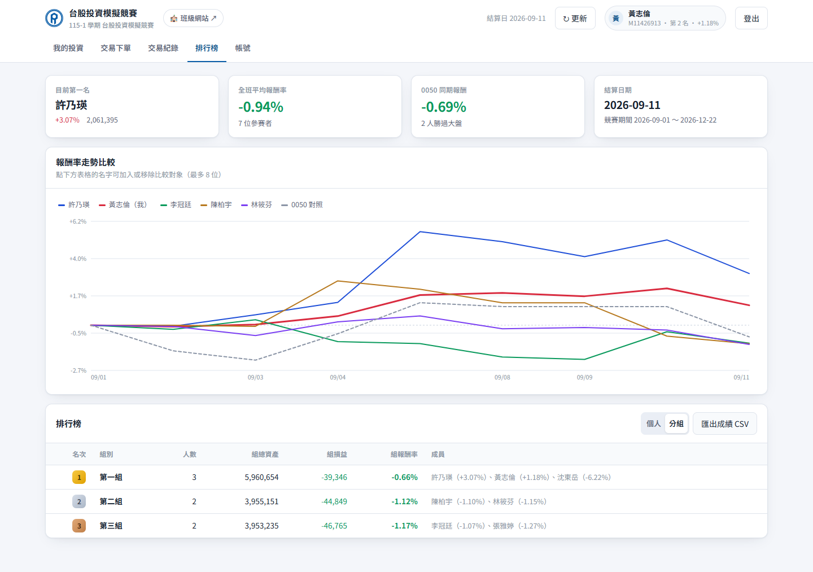

組報酬率 = 全組損益總和 ÷ 全組本金總和。

---

## 8. 帳號設定

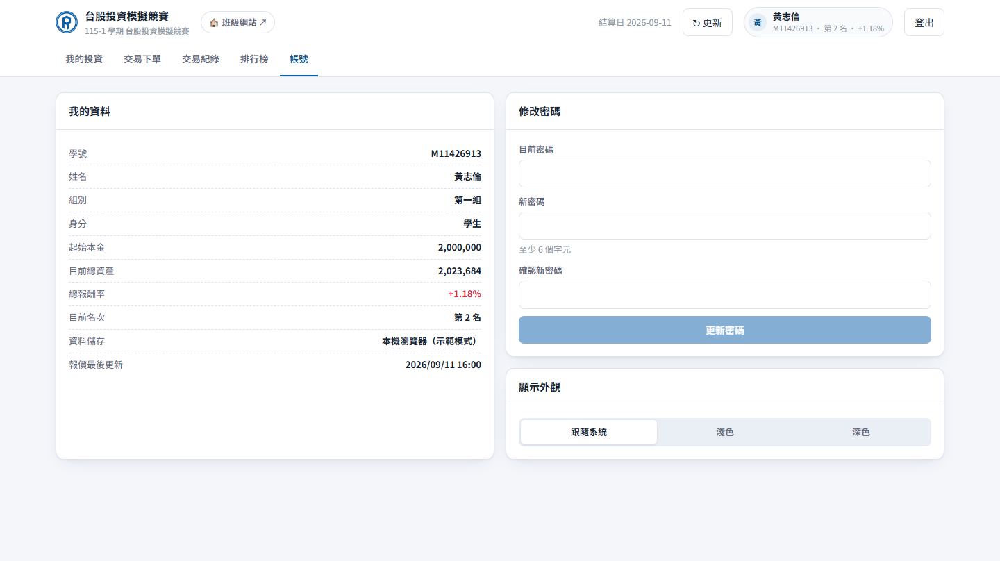

- **我的資料**：確認自己的學號、組別、目前名次
- **修改密碼**：需要輸入目前密碼
- **顯示外觀**：淺色／深色／跟隨系統

---

## 9. 常見問題

<details>
<summary><b>Q：「確認買進」按鈕是灰色的，按不下去</b></summary>

按鈕上方一定會有文字說明原因。最常見的是**搜尋後沒有點選下拉選單中的那一列**，導致系統不知道你要買哪一檔。其他原因見[前面的表格](#為什麼確認買進是灰色的)。
</details>

<details>
<summary><b>Q：為什麼現在不能下單？</b></summary>

平日 09:00–14:00 是台股盤中，系統不開放交易（避免用舊收盤價套利）。等到 **14:00 之後**就可以了，畫面會自動解鎖。六日則全天開放。
</details>

<details>
<summary><b>Q：我買的價格跟我在看盤軟體上看到的不一樣</b></summary>

本競賽一律用**收盤價**成交，不是即時價。下單畫面上會明確寫出「**YYYY-MM-DD 收盤價**」，那就是你的成交價。

美股因為與台股交易日不同步，有時會顯示「（該市場最近一個交易日）」，代表用的是美股上一個交易日的收盤價。
</details>

<details>
<summary><b>Q：忘記密碼怎麼辦？</b></summary>

請聯絡老師處理。系統不會寄密碼重設信（因為沒有用真實信箱）。
</details>

<details>
<summary><b>Q：下錯單了可以取消嗎？</b></summary>

成交後 **30 分鐘內**可以自己刪除該筆紀錄（打錯股數的補救）。超過時間請找老師。
</details>

<details>
<summary><b>Q：可以買零股嗎？可以放空嗎？可以融資嗎？</b></summary>

- **零股**：台股可以，美股本來就是以股為單位
- **放空**：不行，賣出不能超過持股
- **融資**：不行，買進不能超過現金
</details>

<details>
<summary><b>Q：測試期的交易會算成績嗎？</b></summary>

**不會。** 2026-09-11～09-16 是測試期，畫面上方會有黃色提示。正式開賽（09-17）前老師會把所有測試交易清除、本金歸零重來，所以測試期請盡量亂按、把功能玩熟。
</details>

<details>
<summary><b>Q：手機可以用嗎？</b></summary>

可以，畫面會自動調整成單欄。不過看排行榜走勢圖和表格，電腦會舒服很多。
</details>

<details>
<summary><b>Q：股票除權息了，為什麼我的資產變少？</b></summary>

系統用的是**未還原股價**（跟證交所、看盤軟體顯示的一致）。個股除權息當天股價會出現帳面上的跳空缺口，但模擬帳戶不會收到股利，所以會看到資產小幅減少。詳見[交易規則說明](03-交易規則說明.md#除權息的影響)。
</details>

---

<p align="center">
  有其他問題請在課堂或<a href="https://emrd115.netlify.app/">班級網站</a>提出。
</p>
