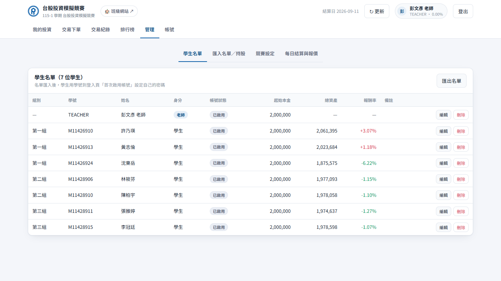
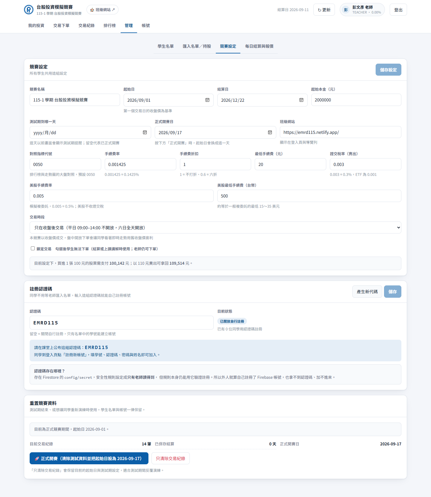
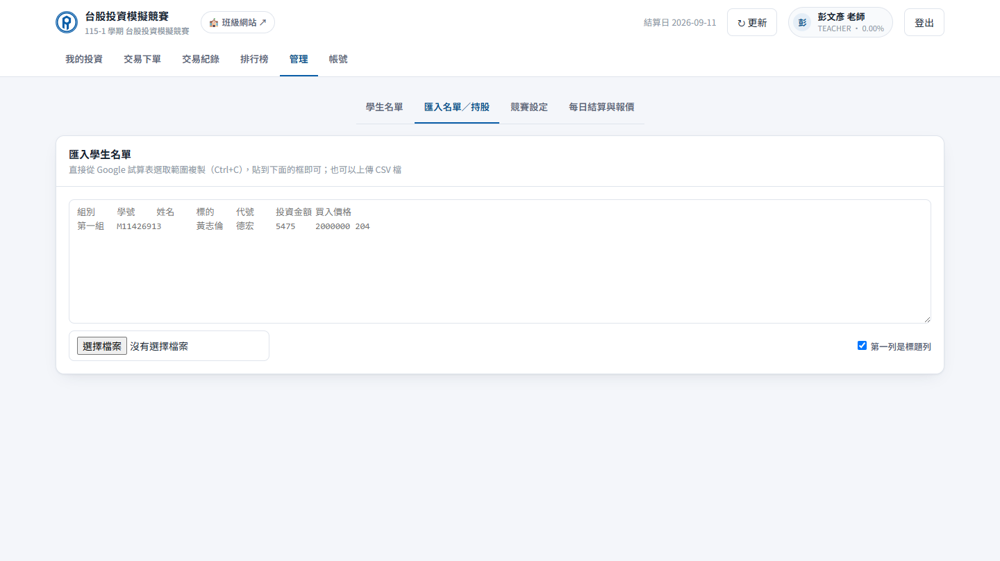
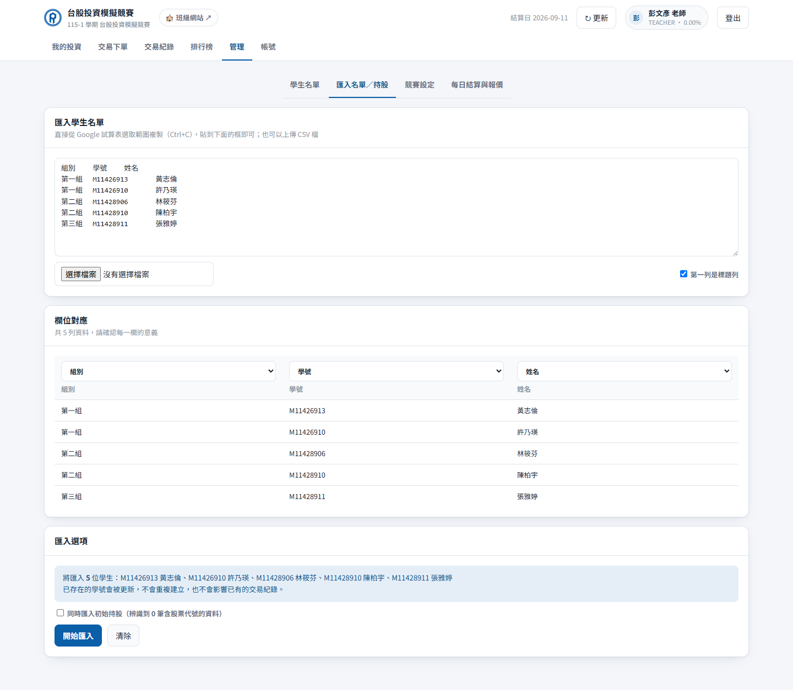
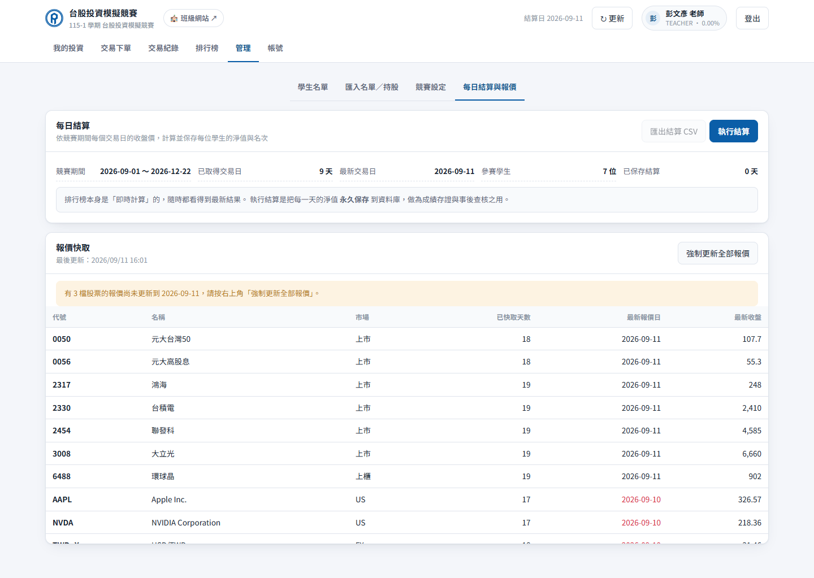

<p align="center"></p>

# 老師管理手冊

> 國立臺灣科技大學　國際經濟趨勢與策略分析（彭文彥）
> 競賽網址：<https://emrd-invest.netlify.app/>

---

## 目錄

1. [管理者帳號](#1-管理者帳號)
2. [開賽前的四件準備](#2-開賽前的四件準備)
3. [註冊認證碼](#3-註冊認證碼)
4. [學生名單](#4-學生名單)
5. [匯入名單與初始持股](#5-匯入名單與初始持股)
6. [競賽設定](#6-競賽設定)
7. [測試期與正式開賽](#7-測試期與正式開賽)
8. [每日結算與報價](#8-每日結算與報價)
9. [成績匯出與評分](#9-成績匯出與評分)
10. [代學生下單與修正錯誤](#10-代學生下單與修正錯誤)
11. [疑難排解](#11-疑難排解)

---

## 1. 管理者帳號

老師帳號的學號是 **`teacher`**，登入後導覽列會多出「**管理**」分頁。



管理者與學生的差別：

| 權限 | 老師 | 學生 |
|---|---|---|
| 修改競賽設定、費率 | ✅ | ❌ |
| 匯入／編輯／刪除學生名單 | ✅ | ❌ |
| 代任何學生下單 | ✅ | ❌ |
| 回補歷史日期的交易 | ✅ | ❌（只能用最新交易日） |
| 刪除任何交易紀錄 | ✅ | 只能刪自己 30 分鐘內的 |
| 執行每日結算、更新報價 | ✅ | ❌ |
| **盤中時段限制** | **不受限** | 受限 |

> 要新增其他管理者：把該生在「學生名單」的**身分**改成「老師」即可。
> （若要讓某個學號一開始就是管理者，需要同時修改 `firestore.rules` 的 `adminIds()` 與 Netlify 環境變數 `VITE_ADMIN_IDS`。）

---

## 2. 開賽前的四件準備

```
① 設定註冊認證碼   → 同學才能自己註冊
② 確認競賽設定     → 起始日、結算日、本金、費率
③ 公布認證碼與網址 → 課堂上宣布
④ 測試期讓大家玩熟 → 09-17 前按「正式開賽」清空重來
```

---

## 3. 註冊認證碼

**管理 → 競賽設定**，中間的「**註冊認證碼**」卡片。



### 操作

1. 按「**產生新代碼**」隨機產生一組 6 碼（已排除容易看錯的 `0/O`、`1/I`），或自己輸入好記的代碼（例如 `EMRD115`）
2. 按「**儲存**」
3. 在課堂上公布這組代碼

同學到登入頁點「註冊新帳號」，填學號、認證碼、密碼、姓名就能自己加入，**你不需要事先匯入名單**。

### 關掉自行註冊

把認證碼**清空**並儲存，就只剩「已匯入名單的學號」能建立帳號。名單截止後建議這樣做。

### 為什麼認證碼是安全的

認證碼存在資料庫中一個**只有老師讀得到**的位置。安全性規則在驗證註冊時仍然讀得到它，但外人即使自行註冊帳號也拿不到 —— 所以拿不到認證碼就加不進來，也看不到全班資料。

---

## 4. 學生名單

**管理 → 學生名單**。


| 欄位 | 說明 |
|---|---|
| **組別** | 分組排名用 |
| **身分** | 學生／老師 |
| **帳號狀態** | 已啟用＝設過密碼；未啟用＝名單有但還沒註冊 |
| **起始本金** | 留空＝沿用競賽預設（200 萬）。可為個別學生設定不同本金 |
| **總資產／報酬率** | 即時計算的目前成績 |

- **編輯**：修改組別、姓名、身分、起始本金、備註
- **刪除**：⚠️ 會**一併刪除該生所有交易紀錄**，無法復原
- **匯出名單**：下載 CSV

---

## 5. 匯入名單與初始持股

**管理 → 匯入名單／持股**。



### 從 Google 試算表直接貼上

把試算表的範圍選起來 `Ctrl+C`，貼到框裡就好，系統會**自動辨識欄位**。



系統認得的欄位：

| 欄位 | 必要 | 說明 |
|---|---|---|
| **學號** | ✅ | 登入帳號 |
| **姓名** | | |
| **組別** | | 分組排名用。同組連續多列時可只填第一列 |
| **代號** | | 勾選「同時匯入初始持股」時才需要 |
| **標的／股票名稱** | | |
| **投資金額** | | 會換算成股數（已預留手續費） |
| **股數** | | 有填就優先用股數 |
| **買入價格** | | 可選擇用檔案價格或當日收盤價 |
| **買入日期** | | 沒填就用畫面上選的日期 |
| **起始本金** | | 留空＝沿用競賽預設 |
| **備註** | | |

**同一位同學有多檔持股時，分成多列、學號重複填寫**即可（跟現有的試算表格式一樣）。

### 欄位對應是可以改的

自動辨識若判斷錯誤，直接用每一欄上方的下拉選單改成正確的意義，或設成「（略過）」。下方會顯示前 6 列預覽讓你確認。

### 匯入選項

- **已存在的學號會被更新**，不會重複建立，也不會影響已有的交易紀錄
- 勾選「**同時匯入初始持股**」可以一併建立買進紀錄
  - **成交價來源**：建議用「該日收盤價」（比較客觀）；也可用檔案中的「買入價格」
  - **股數計算**：沒有股數欄時，以 `投資金額 ÷（成交價 × 含手續費係數）` 換算，**會預留手續費避免現金變負數**

匯入完成後會顯示逐筆結果，查不到收盤價的會標示並略過。

---

## 6. 競賽設定

**管理 → 競賽設定**。這裡的設定**全班共用**。


### 基本

| 設定 | 說明 |
|---|---|
| **競賽名稱** | 顯示在導覽列 |
| **起始日** | 淨值走勢的起算日 |
| **結算日** | 競賽結束日 |
| **起始本金** | 預設 2,000,000 元 |

### 期間與網站

| 設定 | 說明 |
|---|---|
| **測試期到哪一天** | 這天以前全站顯示測試期提醒；留空＝已正式開賽 |
| **正式開賽日** | 按「正式開賽」時，起始日會換成這一天 |
| **班級網站** | 顯示在登入頁與導覽列的連結 |

### 費率

| 設定 | 預設 | 說明 |
|---|---|---|
| **對照指標代號** | `0050` | 排行榜與走勢圖的大盤對照 |
| **台股手續費率** | `0.001425` | 即 0.1425% |
| **手續費折扣** | `1` | 想模擬電子下單折扣可改 `0.6` |
| **最低手續費** | `20` 元 | |
| **證交稅率** | `0.003` | 即 0.3%；若想比照 ETF 可改 `0.001` |
| **美股手續費率** | `0.005` | 模擬複委託 0.5% |
| **美股最低手續費** | `500` 元 | 約等於一般複委託的 15～35 美元 |

下方會即時試算「買進 1 張 100 元的股票要付多少」，方便確認設定是否合理。

### 交易時段

| 選項 | 說明 |
|---|---|
| **只在收盤後交易**（預設） | 平日 09:00–14:00 不開放，六日全天開放 |
| **不限時段** | 隨時都能下單 |

> **為什麼預設要限制？** 競賽以收盤價成交。若盤中開放下單，同學可以一邊看著股價上漲、一邊用前一日收盤價買進，形同穩賺不賠。
>
> **例外情況**：國定假日若落在平日，系統仍會在 09:00–14:00 鎖住（無法自動判斷休市日）。需要的話暫時改成「不限時段」即可。

### 鎖定交易

勾選後**學生完全無法下單**（老師仍可）。適合用在結算時點或上課講解時。

---

## 7. 測試期與正式開賽

**管理 → 競賽設定 → 重置競賽資料**（在競賽設定下方）。

### 測試期

設定「測試期到哪一天」之後，全站會顯示：

> 🧪 **目前是測試期（到 2026-09-16 為止）** 現在可以自由買賣、熟悉操作，所有功能都跟正式競賽一模一樣。**2026-09-17 正式開賽前，這段期間的交易紀錄會全部清除、本金歸零重來**，所以請放心亂按。

導覽列也會出現「測試期」標籤。

### 兩顆重置按鈕

| 按鈕 | 作用 |
|---|---|
| 🚀 **正式開賽** | 清空所有交易與結算 → 起始日換成「正式開賽日」→ 結束測試期提示 |
| **只清除交易紀錄** | 只清資料，保留目前設定（測試期間想重來就用這個） |

兩者都會跳出確認視窗列出實際筆數，而且**學生名單與帳號一律保留** —— 同學不必重新註冊。

> ⚠️ 重置**無法復原**。若想保留測試期資料做紀錄，先到排行榜「匯出成績 CSV」。

---

## 8. 每日結算與報價

**管理 → 每日結算與報價**。



### 每日結算

**排行榜本身是即時計算的**，隨時都看得到最新結果，不需要手動結算。

「**執行結算**」的用途是把**每一天的淨值與名次永久保存**到資料庫，作為：

- 成績存證（事後有爭議可以查）
- 匯出完整的每日淨值資料做分析

建議在**競賽結束時**執行一次，期中若要驗收也可以隨時執行（會覆蓋同一天的資料，不會重複）。

按「**匯出結算 CSV**」可下載每位同學、每個交易日的現金／市值／總資產／報酬率／名次。

### 報價快取

下方表格列出系統已快取的所有股票日收盤價。

| 欄位 | 說明 |
|---|---|
| **已快取天數** | 有幾天的收盤價 |
| **最新報價日** | 若比「最新交易日」舊會標紅 |
| **最新收盤** | |

**只有老師能更新這份快取** —— 因為全班的淨值都以它計價，若開放學生寫入，任何人都能竄改自己持股的收盤價來灌水報酬率。

學生端讀不到快取時會**直接向報價服務取得即時資料**，功能完全不受影響，只是少了共用快取的加速。

> 建議：每天收盤後（14:00 以後）登入一次按「**強制更新全部報價**」，讓全班的資料保持最新。

---

## 9. 成績匯出與評分

### 排行榜 → 匯出成績 CSV

包含：名次、組別、學號、姓名、總資產、現金、持股市值、損益、報酬率、持股檔數、交易次數。

### 交易紀錄 → 匯出 CSV

切到「全班交易」後匯出，包含每一筆買賣的完整資訊：成交價、幣別、匯率、股數、成交金額、手續費、證交稅、淨額、已實現損益、備註、建立時間。

### 可以用來評分的面向

排名只看報酬率，但系統提供的資料可以支撐更完整的評分：

| 面向 | 從哪裡看 |
|---|---|
| **絕對報酬** | 排行榜報酬率 |
| **是否打敗大盤** | 排行榜的「0050 同期報酬」與「N 人勝過大盤」 |
| **分散程度** | 我的投資 → 持股比重（是否All-in 單一個股） |
| **交易成本控制** | 損益拆解 → 累計手續費 ÷ 本金（過度交易的代價） |
| **交易理由** | 交易紀錄的「備註」欄（可要求同學每筆都寫） |
| **台美配置** | 交易紀錄的「市場」欄 |
| **團隊合作** | 分組排行榜 |

---

## 10. 代學生下單與修正錯誤

### 代下單

**交易下單**頁，老師會多看到兩個欄位：

- **交易日**：可選擇任何歷史交易日（學生只能用最新交易日）
- **代誰下單**：下拉選單選擇學生

適合用在：同學帳號有問題、補登初始持股、修正錯誤。

### 刪除交易

**交易紀錄** → 切到「全班交易」 → 每列右側的「**刪除**」。

刪除後淨值與排名會立即重新計算。

> 學生自己只能刪除**成交後 30 分鐘內**的紀錄（打錯股數的補救），超過就要找你。

---

## 11. 疑難排解

<details>
<summary><b>同學說「此帳號已啟用，請直接登入」但名單裡查無此人</b></summary>

發生原因：他**之前試過一次但沒成功**（多半是認證碼打錯）。帳號當時已經建立，只是還沒加入名單。

**處理方式：請他用同一組密碼再註冊一次即可。** 系統會自動認出這個帳號、直接登入，並接著完成加入名單。

若他忘記當初設定的密碼，才需要你到 Firebase 主控台 → **Authentication → Users** 搜尋 `{學號小寫}@ntust-invest.local` 把該帳號刪除，之後他就能重新註冊。
</details>

<details>
<summary><b>同學說註冊時出現「名單中查無此學號」</b></summary>

代表**認證碼沒設定**或**同學打錯了**。到 管理 → 競賽設定 → 註冊認證碼 確認有設定並已儲存，再把代碼重新公布一次。

同學若卡在「再一步就完成了」的畫面，直接補填正確認證碼即可，不用重設密碼。
</details>

<details>
<summary><b>畫面出現「沒有存取資料的權限」</b></summary>

兩種可能：

1. 該學號還沒加入班級名單 → 請他用認證碼完成註冊
2. 資料庫安全性規則沒有部署 → 見專案根目錄 `README.md` 的 Firebase 設定章節
</details>

<details>
<summary><b>某檔股票抓不到報價</b></summary>

- 確認代號正確（台股 4 碼數字、美股英文代號）
- 興櫃股票、剛上市未滿一日的股票可能還沒有資料
- 到 管理 → 每日結算與報價 → 「強制更新全部報價」
</details>

<details>
<summary><b>排行榜的結算日不是今天</b></summary>

正常。系統以**最後一個已確認的收盤日**結算。平日 14:00 前，當天收盤價還沒定案，所以結算日會是前一個交易日。
</details>

<details>
<summary><b>想換一個對照指標（不用 0050）</b></summary>

管理 → 競賽設定 → 「對照指標代號」改成其他代號（例如 `0056`、`006208`），儲存後走勢圖與排行榜的對照線會跟著換。
</details>

<details>
<summary><b>某位同學的帳號要重置</b></summary>

在學生名單刪除該生（會一併刪除交易紀錄），請他用同一學號重新註冊。
若只是要清除交易而保留帳號，請用「代下單 + 刪除交易」的方式處理。
</details>

---

<p align="center">
  技術細節、部署方式與資料庫設定請見專案根目錄的 <a href="../README.md">README.md</a>
</p>
